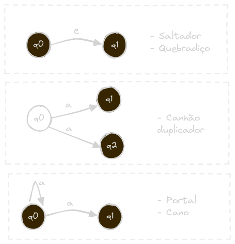
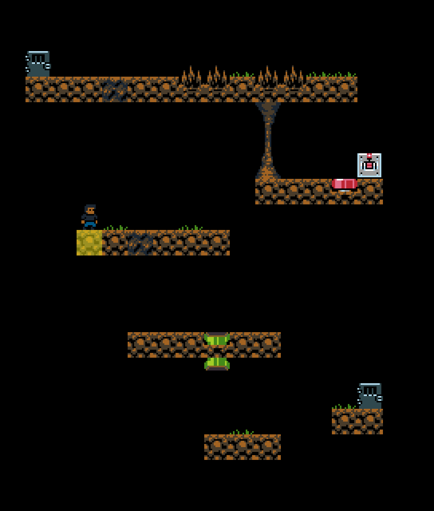
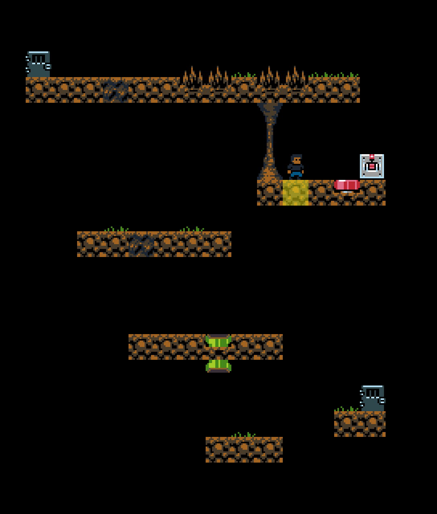
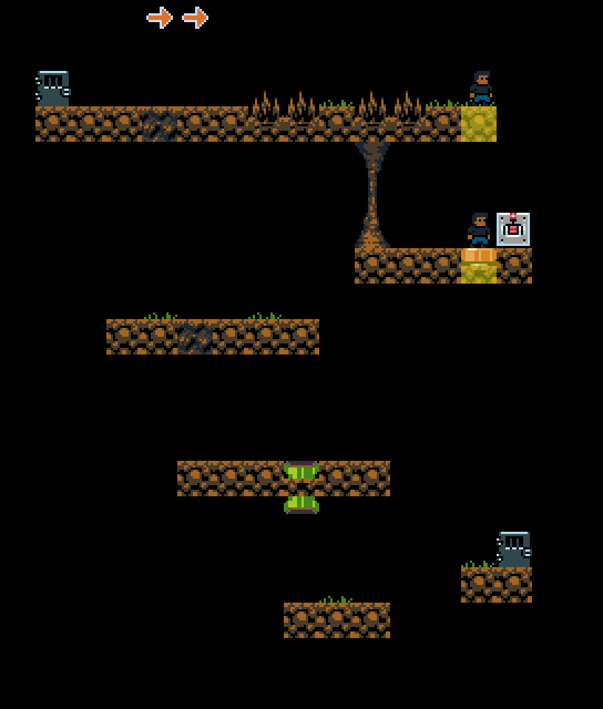

# Echos: Um Platformer Não Determinístico

Echos é um platformer onde cada fase consiste numa representação gráfica de um AFN. O jogador inicia em uma posição inicial e o objetivo é  encontrar uma sequência de movimentos que o permita chegar a uma posição final. Contudo, durante o percurso, existirão objetos não determinísticos que criarão ecos do jogador e o mesmo precisará controlar todos ao mesmo tempo.

- O Alfabeto consiste nos movimentos de input:
  - $\Sigma: \{\rightarrow, \leftarrow, \uparrow, \downarrow , \nwarrow, \nearrow\}$
- Ecos podem sumir se o movimento escolhido não chegar a ao menos um outro estado
- Qualquer eco do jogador que chegar em um estado final conclui a fase.

## GUI do Jogo

Seguem alguns exemplos animados dos obstáculos não deterministicos presentes no jogo.

### _Tile_ Quebradiço:

### _Tile_ Saltador:

### _Tile_ com Portal:

